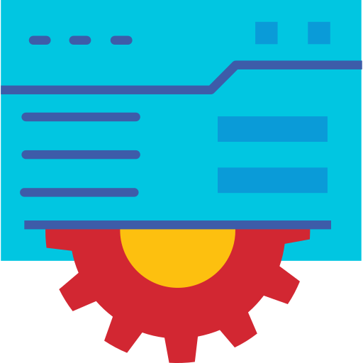
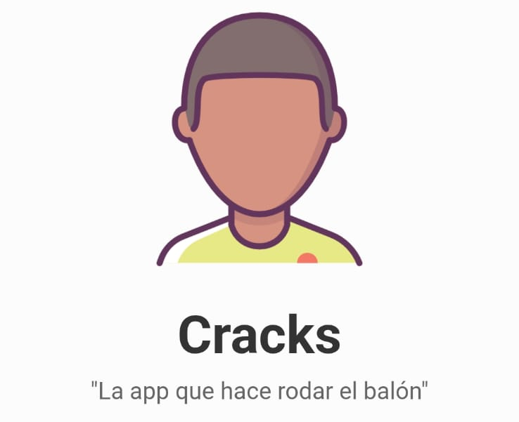
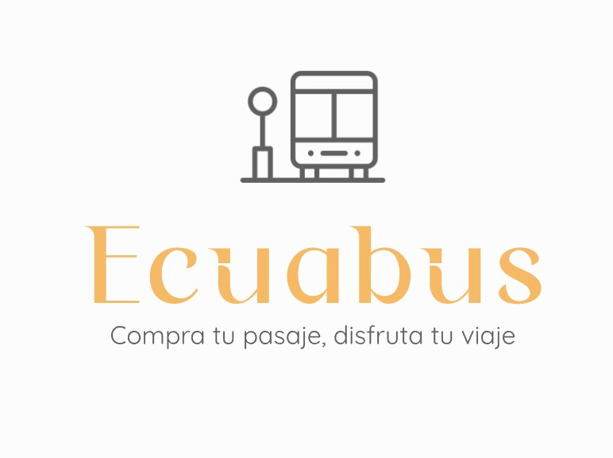
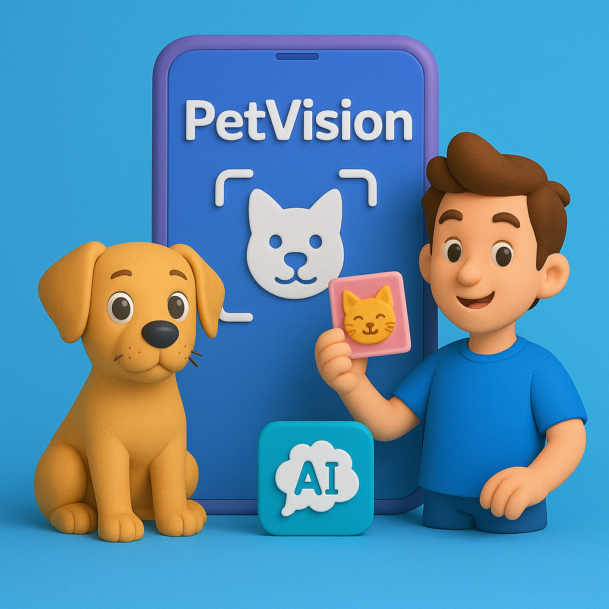
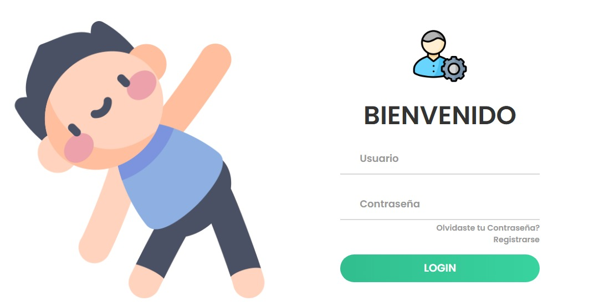
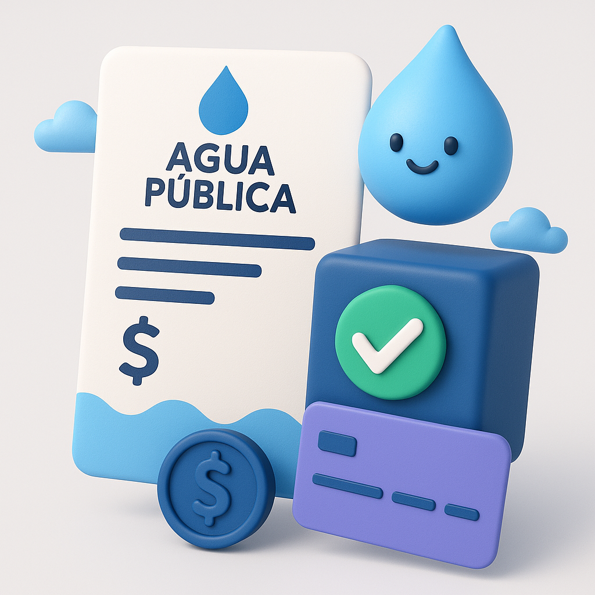

<h1 align="center">"Coding is not just a job, it's an adventure."</h1>

<h2 align="center">A Passionate Software Engineering from Ecuador.
</h2>

<h2 align="center">"Backend Developer"&nbsp;&nbsp;&nbsp;"Mobile Developer"&nbsp;&nbsp;&nbsp;"Frontend Developer"</h2>

  

- 📫 How to reach me: **gabomedina1007@gmail.com**
- 📍 Ambato-Ecuador.
- 👨‍💻 Software Engineer.
- 📚 Technical University of Ambato.
- ⚽ Real Madrid and CR7 Lover!!!

<h3 align="left">Connect with me:</h3>

  
  
  
  

### 🧰 Tech Stack

| Frontend | Backend | Mobile | DevOps / Cloud | Database |
|---------|---------|--------|----------------|----------|
|  |  |  |  |  |
|  |  |  |  |  |
|  |  |  |  |  |
|  |  |  |  |  |
|  |  |  |  |  |
|  |  |  |  |  |

 ## 🚀 Featured Projects

 

###
| <h2 style="font-size: 24px;">Sistema SaaS VetControl 🐾</h2> | <h2 style="font-size: 24px;">CracksApp ⚽</h2> |
|------------|-----------|
| 

 | 

 |
| 
Plataforma profesional para clínicas veterinarias que incluye:   • Historial médico digital • Agenda de citas inteligente • Módulo de facturación electrónica • Control de inventario automatizado • Reportes estadísticos   | 
Aplicación móvil para gestión de torneos de fútbol con:   • Administración de equipos/jugadores • Calendario de partidos • Resultados en tiempo real • Tablas de posiciones • Notificaciones push   |
| 
   
 | 
  
 |
| 
[🔗 Repositorio](https://github.com/GabooMedina/VetControl-Frontend) \| [🌐 Sitio Web](https://example.com/vetcontrol)
 | 
[🔗 Repositorio](https://github.com/GabooMedina/Cracks-AppMovil)  

###
| <h2 style="font-size: 24px;">EcuaBus App 🎫</h2> | <h2 style="font-size: 24px;">PetVision 🤖</h2> |
|------------|-----------|
| 

 | 

 |
| 
Solución integral para cooperativas de transporte que incluye:   • Gestión inteligente de rutas y horarios • Control de conductores y vehículos • Venta digital de boletos • Reportes financieros automatizados • Monitoreo en tiempo real  | 
Clasificador de imágenes de perros y gatos en tiempo   real que funciona directamente en el navegador:  • Modelo entrenado con TensorFlow • Reconocimiento desde cámara o fotos • 100% ejecución en el navegador • Interfaz intuitiva y responsive  |
| 
  
 | 
  
 |
| 
[🔗 Repositorio](https://github.com/GabooMedina/EcuaBus)  | 
[🔗 Repositorio](https://github.com/GabooMedina/petVision) \| [🖥️ Demo](https://ringa-tech.com/exportacion/perros-gatos/)
 |

###
| <h2 style="font-size: 24px;">FitMe🥗</h2> | <h2 style="font-size: 24px;">CI/CD Pipeline 👨🏻‍💻</h2> |
|------------|-----------|
| 

 | 

 |
| 
Sistema  Movil/Web de Análisis nutricional que permite:   • Seguimiento detallado de ingesta calórica • Reportes estadísticos por día/semana/mes/año • Visualización de progreso y tendencias • Alertas personalizadas según metas  
 | 
Implementación profesional de pipelines CI/CD con Jenkins:   • Pipelines automatizados en Jenkins • Ejecución de pruebas unitarias/integración • Despliegues en múltiples entornos • Integración con Docker y repositorios Git  
 |
| 
  
 | 
  
 |
| 
[🔗 Repositorio](https://github.com/GabooMedina/Fitme) | 
[🔗 Repositorio](https://github.com/GabooMedina/JenKins)|

| <h2 style="font-size: 24px;">Agua Pública 💧</h2> | <h2 style="font-size: 24px;">Sistema Célula Académica UTA 📚</h2> |
|------------|-----------|
| 

 | 

 |
| 
Sistema Completo para facturación de Agua pública   Santa Rosa  • Gestión de Cobros • Gestión de Clientes • Facturación Electrónica • Reportes diarios 
 | 
Plataforma Educativa para Gestión de Eventos Académicos con:   • Inscripción a eventos programados • Calendario de actividades • Información de eventos • Gestión de eventos • Noticias facultativas 
 |
| 
  
 | 
  
 |
| 
[🔗 Repositorio](https://github.com/GabooMedina/Junta-de-Agua) \| [🌐 Sitio Web](https://junta-de-agua.vercel.app/login) 
  | 
[🔗 Repositorio](https://github.com/GabooMedina/Celula-Academica) \| [🏫 Sitio Web](https://front-celula-academica.vercel.app/)
 |

&nbsp;

